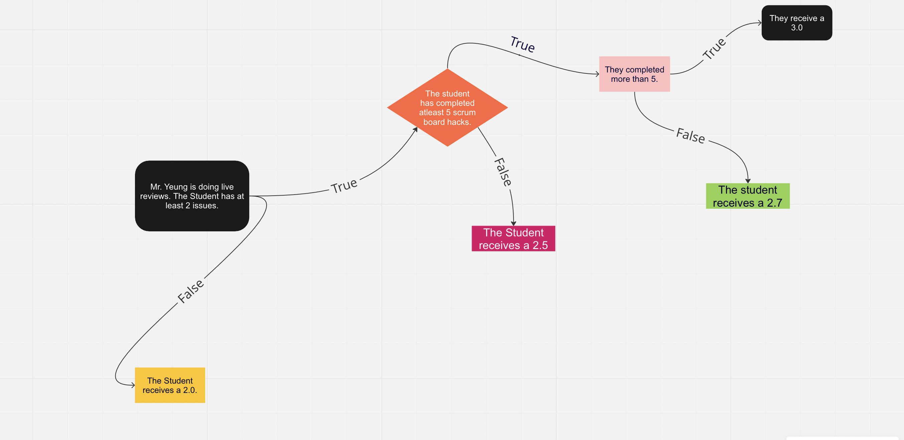

# 3.5-3.7 Notes

## 3.5 
> Write expressions with logical operators and evaluate expressions that use logical operators

### Vocab/Big Ideas
*Boolean*- binary variable with only two possible values, "true" or "false"
There are multiple operators used to evaluate 2 variables. 
In pseudocode the relational operators are =, >, <, ≠, ≥, and ≤. 
Python uses != instead of ≠. These operators help determine the boolean value of a statement.

### Logical Operators
Logical operators allow for boolean values to be evaluated. 
Pseudocode uses the logical operators NOT, AND, and OR. Javascript uses the same logic, but uses different ways to represent the operators: &&(and), | |(or), |(not).

<html>

    
Relational Operators Table

      
    
Value 1 and Value 2(And operator)

    

        <table>
            <tr>
                <th>Value 1</th>
                <th>Value 2</th>
                <th>Result</th>
            </tr>
            <tr>
                <td>True</td>
                <td>True</td>
                <td>True</td>
            </tr>
            <tr>
                <td>True</td>
                <td>False</td>
                <td>False</td>
            </tr>
            <tr>
                <td>False</td>
                <td>True</td>
                <td>False</td>
            </tr>
            <tr>
                <td>False</td>
                <td>False</td>
                <td>False</td>
            </tr>
        </table>
    

    
Value 1 or Value 2(Or operator)

    

        <table>
            <tr>
                <th>Value 1</th>
                <th>Value 2</th>
                <th>Result</th>
            </tr>
            <tr>
                <td>True</td>
                <td>True</td>
                <td>True</td>
            </tr>
            <tr>
                <td>True</td>
                <td>False</td>
                <td>True</td>
            </tr>
            <tr>
                <td>False</td>
                <td>True</td>
                <td>True</td>
            </tr>
            <tr>
                <td>False</td>
                <td>False</td>
                <td>False</td>
            </tr>
        </table>
    

    
Not operator

    

        <table>
            <tr>
                <th>Not</th>
                <th>Value</th>
                <th>Result</th>
            </tr>
            <tr>
                <td>Not</td>
                <td>True</td>
                <td>False</td>
            </tr>
            <tr>
                <td>Not</td>
                <td>False</td>
                <td>True</td>
            </tr>
        </table>
    

## 3.6 
> Write conditional statements

### Vocab and Big Ideas
- *Algorithm*: Finite set of instructions that accomplish a specific task
- *Conditional Statements*: allow the code to act based on multiple conditions, such as user input or stored data
- use in order to receive different outputs from a set of code, and help achieve the general purpose of the algorithm
- *Categories*: 2 broad types of conditional statements are if statements and if-else statements
- *if statement*: will go through certain statements if the if expression is true
- *if-else statement*: will go through a statement no matter what, but the statement which is run depends on the if expression is true or false

## 3.7 
> Write nested conditional statements, determine the result of them

### Vocab and Big Ideas
- *Nested conditional*: A conditional inside of a conditional. Used in algorithms in order to print specific data or run certain tasks, to create further conditions in algorithms.
We can use flowcharts to help display an easy to understand diagram of what we want a code segment to do.

---

# 3.5 Hacks

## Binary Practice
Using psuedocode operators determine if the statements are true or false. The number type will be indicated in parentheses.

**1. 90(Decimal) = 1000(Binary)**

- A. True
- B. False

- Answer: B False

**2. 10(D) ≠ 0110(B)**

- A. True
- B. False

- Answer: A True 

**3. 56(D) ≥ 111000(B)**

- A. True
- B. False

- Answer: A True

**3. 99(D) < 1110011(B)**

- A. True
- B. False

- Answer: A True 
Now, complete the binary truth tables
<html>

    
AND Operator

    

        <table>
            <tr>
                <th>Value 1</th>
                <th>Value 2</th>
                <th>Result</th>
            </tr>
            <tr>
                <td>1</td>
                <td>1</td>
                <td>1</td>
            </tr>
            <tr>
                <td>1</td>
                <td>0</td>
                <td>0</td>
            </tr>
            <tr>
                <td>0</td>
                <td>1</td>
                <td>0</td>
            </tr>
            <tr>
                <td>0</td>
                <td>0</td>
                <td>0</td>
            </tr>
        </table>
    

    
OR Operator

    

        <table>
            <tr>
                <th>Value 1</th>
                <th>Value 2</th>
                <th>Result</th>
            </tr>
            <tr>
                <td>1</td>
                <td>1</td>
                <td>1</td>
            </tr>
            <tr>
                <td>1</td>
                <td>0</td>
                <td>1</td>
            </tr>
            <tr>
                <td>0</td>
                <td>1</td>
                <td>1</td>
            </tr>
            <tr>
                <td>0</td>
                <td>0</td>
                <td>0</td>
            </tr>
        </table>
    

    
Not operator

    

        <table>
            <tr>
                <th>Not</th>
                <th>Value</th>
                <th>Result</th>
            </tr>
            <tr>
                <td>Not</td>
                <td>1</td>
                <td>0</td>
            </tr>
            <tr>
                <td>Not</td>
                <td>0</td>
                <td>0</td>
            </tr>
        </table>
    

</html>
## Python Practice
# Testing out relational operators
# Practice with these statements

print(20 < 20) # How can you change the operator to print a value of False?

x = 30
y = 20
z = 10
print(x >= y + z) # How can this return true by only manipulating the operator?

x = 30 
z = 30 

print(x == z) # Change values to return true

# 3.6 Hacks

## AP Prep

**1. What is displayed by this code?**
- result <-- 75
- IF result < 80 {
    DISPLAY("Please schedule a retake.")
}  
- ELSE {
    DISPLAY("Nice job!")
}

1. Nice job!
2. Display
3. Please schedule a retake.
4. 75

-  3 "Please schedule a retake." Because the if condition is met, 75 < 80 so the if display is shown.

**2. How is an if statement different from an if-else statement.**

1. Extra words.
2. An if statement will only go through a process if a condition is met. An if-else statement will go through code no matter the conditions.
3. They are the exact same.
4. An if statement will go through the entire code segment every single time and the if-else statement is always used in an algorithm, no matter the conditions.

-  2 Because in if statements the criteria needs to be made in order to go through the code. 

**3. What would be most appropriate for this situation? Ben wants to check his bank account. If his car fuel is full, he will go to the bank. Otherwise, he will go home. If he goes to the bank, he will withdraw money only if his balance is above $1000.**

1. If statement
2. If-else statement

-  2 If-else, because if he has gas he will go to the bank BUT else (gas is not full) he will go home.

**4. What would be most appropriate for this situation? Luke wants to play basketball. If it is sunny outside he will go to the park to play basketball.**

1. If statement
2. If-else statement

-  1 as there is no second option. It does not specify what Luke will do on a day when it is not sunny.

## Using Python
animals = ["lion", "tiger", "wildebeest", "shark", "jellyfish", "blobfish", "raven"]

for i in animals:
    if i == "shark": # What boolean value does this statement cause? Answer: True
        print("Fun Fact: The smallest shark is the dwarf lantern shark, and it is small enough to hold in your hand!")
    else:
        print(i)

for i in animals:
    if i == "lion" or "wildebeest" or "raven":
        print("This animal lives in the desert")
    else: 
        print(i + " This animal does not live in the desert")
# Practice
# Using only one more if statement, alter the code to print out a statement saying if an animal lives in the desert, based on booleans
# 3.7 Hacks

## Exercise 1
- Create dictionaries for multiple food items, with the listed specifications
    - Chicken Alfredo, Meat: Chicken, Time to Prepare: 60 minutes
    - Cheese Quesadilla, Meat: None, Time to Prepare: 10 minutes
    - Beef Wellington, Meat: Beef, Time to Prepare: 150 minutes
- Used nested conditionals, determine which meal you can cook, given that a) you have no meat at home, and b) you only have 30 minutes to make the meal
# Write code here

chickenAlfredo = {
    "meat": True, 
    "Time": 60,
}

cheeseQuesadilla = {
    "meat": False, 
    "Time": 10,
}

beefWellington = {
    "meat": True,
    "Time": 150,
}

def cookMeal(dish):
    if dish["Time"] <= 30: 
        if dish["meat"] == False:
            print("You can cook the meal!")
        else:
            print("You do not have enough time and cannot cook the meal!" )
    else:
        print("You do not have meat and cannot cook the meal!")

cookMeal(chickenAlfredo)
cookMeal(cheeseQuesadilla)
cookMeal(beefWellington)
        
## Exercise 2

Make a flowchart and write pseudocode for the following scenario.
- Mr. Yeung would like to grade live reviews. 
- He wants to see if each student has at least 2 issues on their project. If they don't they receive a score of 2.0.
- If they have at least 2 issues, check that they have completed at least 5 of their scrumboard tasks.
- If they have completed 5 scrumboard tasks, give the student a 2.7. If they have not completed 5 scrumboard tasks, give them a score of 2.5. If they have completed more than 5 tasks, give them a score of 3.0.
- How much would a student with 3 issues and 1 complete scrumboard task receive?

A student with 3 issues and 1 completed scrumboard task would receive a 2.5.