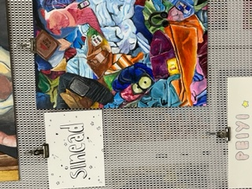
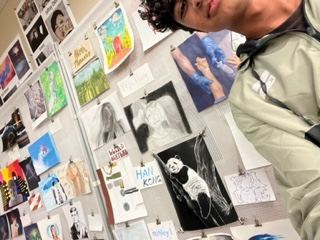
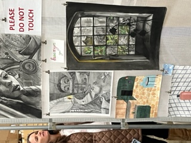
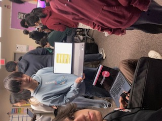
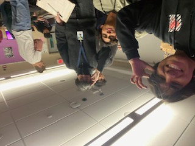
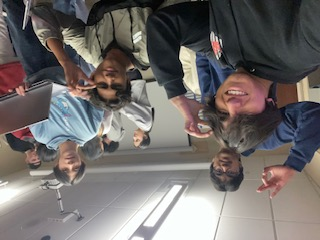
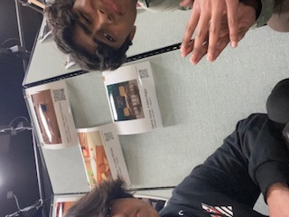
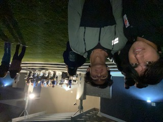
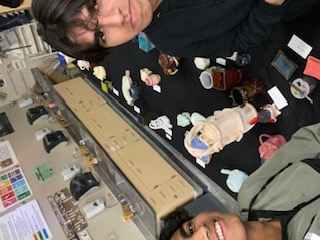
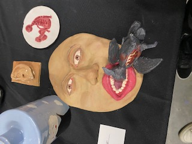

# Night at the Museum:  

- Other Groups:
  - Night at the Museum was an incredible experience and I had a great time. I enjoyed visiting other classes and experiencing other teams present their projects. I think that a project I found interesting was Furry Friend Finder. I thought that this was a very cohesive project with an interesting idea. I was particularly interested by their way of matching users with dogs and I think they had a well crafted user experience. First I filled out a form regarding my day to day habits, and next I inputted my likings in dogs, and finally I was presented with different dog breeds and specific dogs which I could purchase. Another project I found interesting was a Hotel/Vacation Organizer. I thought that it was interesting as it allowed users to find houses to rent in specific parts of the world based on their liking and price point. I loved playing with an Arcade/Game Pigeon game project as well. It had 3 different types of games such as chess, checkers, and battleship. I loved how you could play chess live with another person. I thought that the overall project was very fun and the integration was seamless.
- Our Project:
  - I think that our project utilized databases very well and our overall idea was very interesting. WE had a great time working on our project but I think that we were somewhat unprepared during N@TM as it took us a great amount of time to learn how to use Svelte and Firebase. I think that we could have definitely worked with AWS and Fastpages but we decided to challenge ourselves. I think that we can grow our platform to a great extent through Svelte and Firebase but I think that the learning curve causes issues as it stops us from working on multiple aspects. It takes time to understand how to use it and then time to utilize it. Despite the challenges we faced, I think we did a great job as we had an interesting project with interesting features.

- Other Classes:
  - I had a great time visiting other classes. i was especially fascinated by the detail and quality of the projects showcased in Ceramics and AP Studio Art. I was able to find my friends projects and I was in awe by some of the projects sheer creativity. I think that I might take Ceramics later on and I truly enjoyed seeing some of their projects. I also visited 3D Animation and I was able to find some of my friends projects. I was interested in how they worked on it and I enjoyed seeing the creativity expressed. 
- However I think my favorite part of the night was definetely enjoying the live music. It was especially great as one of my teammates, Ryan was performing. Overall I had a great time at Night at the Museum.
  
  

